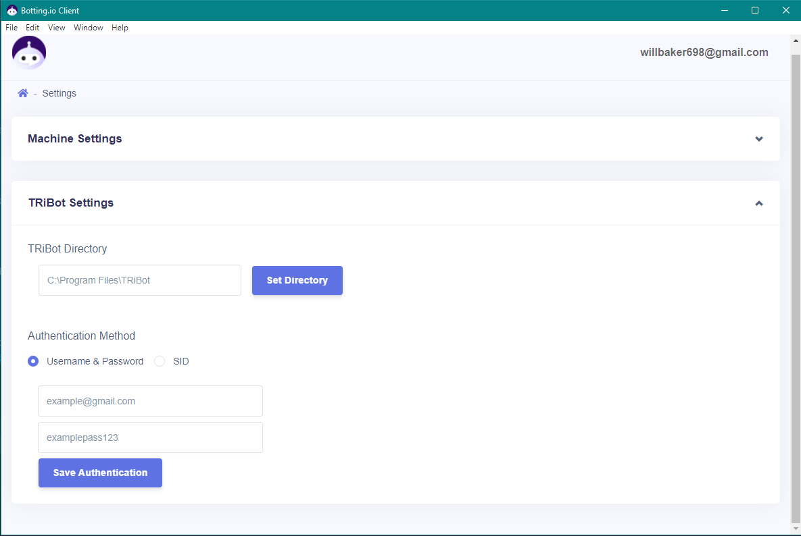

# Botting.io

## Client setup

### Download and install the latest release

To get started, you first want to download and install the latest release from [releases](https://github.com/BottingIo/Botting.io-Client/releases).

#### TRiBot Configuration

You will have to configure some basic TRiBot settings once you launch the app and login.

Navigate to "Settings" by clicking your username in the top right of the application.

Here you will want to enter in your TRiBot folder which contains `tribot-gradle-launcher`

You will also need to enter either your TRiBot username & password, or your SID to allow client launching.



## TRiBot Setup

To setup TRiBot, you will need to create a file in your .tribot settings folder.

The file name should be `automation-settings.json`, and the contents should be:

```
{
    webServerUrl: "http://localhost:8084"
}
```